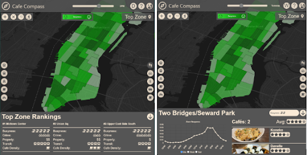
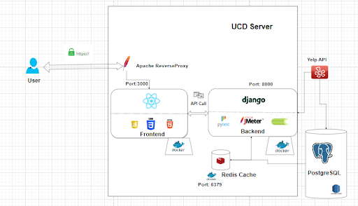

# About the Website #

This project addresses the challenge of generating busyness predictions for locations in
Manhattan and translating these predictions into actionable insights for end users. Specifically, it explores
the decision-making process for prospective cafe owners when selecting an optimal cafe location in
Manhattan. The project’s objectives involve creating a responsive and intuitive data-driven web application
which predicts busyness through the use of freely available taxi, Citi bike, and subway data. The project
employs React with Mapbox and Chart.js for the front-end, while the back-end relies on Django, Redis
Cache, and an SQL database to manage busyness predictions and cafe-related data. The XGBoost model
emerges as the most effective machine learning algorithm for generating busyness predictions. The use of
caching is found to significantly improve the website performance

# Front End Info #

The front-end of our application utilised React, a JavaScript framework used for building single page web applications. The reason we went with React is that it offered a variety of features that vanilla JavaScript was lacking. React’s component based design made it easy to collaborate as the simultaneous creation of features did not impact other features as the code is encapsulated in each component. Additionally, React’s hooks, a collection of functional components, allowed us to write cleaner code as it allows for more reusability in our logic. React also allows us the option of porting our web application to mobile devices using React Native.

When deciding how to display busyness data in Manhattan we wanted to use a map, thus, a key decision was whether to use Google Maps or Mapbox. We had no plans on showing routes on our map which would have made Google Maps the clear choice, so instead we opted to use MapBox which gave us greater control in displaying data and customising the look of our map. Mapbox has a variety of built in functions that allows us to add GeoJSON data to our map as layers which we used to display markers on the map and create a custom heatmap. 

# Back End Info #

Django was the selected backend framework for our project. Reasons for choosing Django include Django's views function (which is used to process web requests and return a web response), streamlined URL dispatcher, capacity for serialisation, and strong support for object-relational mapping, all of which made Django an ideal fit for our application. 

To improve the performance of our backend, we implemented caching through Redis, chosen for its support for persistence (unlike Memcache). Both the prediction data and the cafe data were cached with suitable expiries to prevent the cache from filling up and ensuring we complied with Yelp terms and conditions (data is not allowed to be cached for longer than 24 hours as stipulated by Yelp terms and conditions). The use of caching not only helped to improve the performance of our website, it also reduced the number of API calls we made, ensuring that we did not hit the limits placed on the Yelp API. 

We handled the possibility of cache inaccessibility by implementing error handling to retrieve data from alternative sources like our database or via a Yelp API call. This can be seen in Figure 7. As there were expiries placed on the cached data and the data required for the 24 hour predictions would change each day, we also had to account for the fact that the data may not always be cached. To avoid this issue, we implemented automated caching through the use of Celery and Celery Beat. We had a number of Celery tasks which were automatically run each day at 2am (when website traffic was assumed to be low), ensuring that the cache was constantly populated with the required data. The addition of automatic caching through the use of Celery and Celery Beat ensures that data should always be served from our cache so long as our cache is accessible.

# COMP47360RearchPracticum_Project

Submission link for group 5:
https://csi6220-2-vm4.ucd.ie/#

Group members:
- Zhan Li
- Cormac Egan
- Maximilian Girt
- Nicholas Hegarty
- Colmán Larkin
- Yuntao Wei

Steps:
To access our website you can use the link provided above

Alternatively, if you wish to run the website locally you can clone our repository (ensuring that you work off of main). 

It is recommended that you create an anaconda environment and use the requirements.txt file to install the necessary modules to run the python backend. 

To install the necessary frontend packages you will have to use node packet manager (npm) in COMP47360RearchPracticum_Project/coffee-compass, running npm install will install the neccessary packages as detailed in package.json and package-lock.json

Currently the code is configured on main so that it connects to the __endpoints on the server__. This means you will solely be running the __frontend__ locally. In order to do this you must open up terminal and navigate to the folder called “coffee-compass” (COMP47360RearchPracticum_Project/coffee-compass) and run npm start. This will launch the local development server on http://localhost:3000

Should you wish to run the backend locally you must 
1. Install redis and redis-stack (this will be used for caching)
2. Create a postgresql db populating it with predictions and cafe data. This is done by:
    1. Going to COMP47360RearchPracticum_Project/backend in terminal and running 
        1. python manage.py makemigrations
        2. python manage.py migrate
    2. Running the code in the jupyter notebook “using_predictions.ipynb” to populate the predictions table
    3. Going to COMP47360RearchPracticum_Project/backend in terminal and running manage.py populate_aggregated_predictions
3. Change the code in settings.py to use the local redis server
4. Change the code in settings.py to use the local postgresql db rather than the AWS RDS
5. Change the code in store.js to use the locally hosted api endpoints (rather than the endpoints hosted on the ucd server)
6. Create 2 terminal tabs
    1. In the first go to COMP47360RearchPracticum_Project/backend and run “python manage.py runserver”. This will start the django development server on http://127.0.0.1:8000
    2. In the second again go to COMP47360RearchPracticum_Project/backend and run redis-stack-server. This will launch the redis stack server to enable caching on the website

If you complete these steps you should now be running both the backend and the frontend of the website locally!
